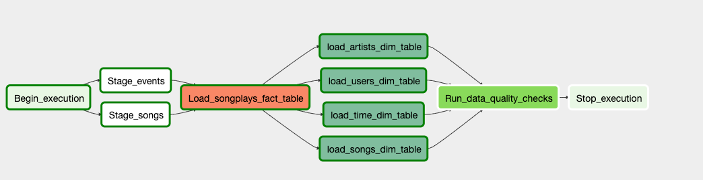
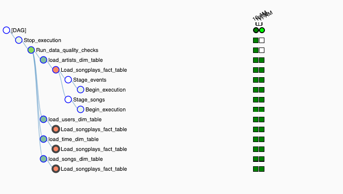

## Data Pipelines with Airflow

### Project Brief
A music streaming company, Sparkify, has decided that it is time to introduce more automation and monitoring to their data warehouse ETL pipelines and come to the conclusion that the best tool to achieve this is Apache Airflow.

The task is to create high grade data pipelines that are dynamic and built from reusable tasks, can be monitored, and allow easy backfills. Sparkify have also noted that the data quality plays a big part when analyses are executed on top the data warehouse and want to run tests against their datasets after the ETL steps have been executed to catch any discrepancies in the datasets.

The source data resides in S3 and needs to be processed in Sparkify's data warehouse in Amazon Redshift. The source datasets consist of JSON logs that tell about user activity in the application and JSON metadata about the songs the users listen to.

### Dataset 
The s3 links for each:
**Log data**: `s3://udacity-dend/log_data`
**Song data**: `s3://udacity-dend/song_data`

### Building the operators
To complete the project, four different operators will be built to stage the data, transform the data, and run checks on data quality.
All of the operators and task instances will run SQL statements against the Redshift database by utilising the usage of parameters.

##### Stage Operator
The stage operator is expected to be able to load any JSON formatted files from S3 to Amazon Redshift. The operator creates and runs a SQL COPY statement based on the parameters provided. The operator's parameters specify where in S3 the file is loaded and what is the target table.

##### Fact and Dimension Operators
With dimension and fact operators, we will use the SQL helper class to run data transformations. Most of the logic is within the SQL transformations and the operator is expected to take as input a SQL statement and target database on which to run the query against. 

Dimension loads need to have a truncate-insert pattern where the target table is emptied before the load. A parameter should be built to allow switching between insert modes when loading dimensions. 

##### Data Quality Operator
The final operator to create is the data quality operator, which is used to run checks on the data itself. The operator's main functionality is to receive one or more SQL based test cases along with the expected results and execute the tests. For each the test, the test result and expected result needs to be checked and if there is no match, the operator should raise an exception and the task should retry and fail eventually.

### Dags
The dag view below illustrates the task dependencies:
`Configuration of the dag`
- The DAG does not have dependencies on past runs
- On failure, the task are retried 3 times
- Retries happen every 5 minutes
- Catchup is turned off
- Do not email on retry

